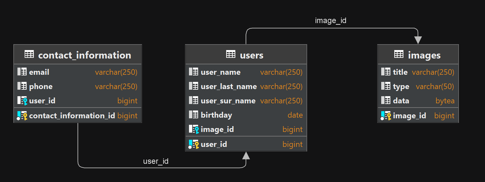

## Users-Directory - backend service for process users data.

Users-Directory contains various tools for working with users data.

### Functional and structure:
Users-Directory is REST application with one module, use PostgreSQL DB, that allows you to add, update, remove 
data users from DB with parameters such as name, lastName, etc., also you can add and update contact information 
about users and save it in DB. Also, as a feature of this project you can add images to users.

Structure:

Also, as a feature of this project you can add images to users.

### Technology stack:
<a href="https://spring.io/">
  &nbsp;
</a>
<a href="https://maven.apache.org/">
  &nbsp;
</a>
<a href="https://www.postgresql.org/">
  &nbsp;
</a>
<a href="https://www.baeldung.com/the-persistence-layer-with-spring-data-jpa">
  &nbsp;
</a>
<a href="https://hibernate.org/">
  &nbsp;
</a>
<a href="https://projectlombok.org/">
  &nbsp;
</a>
<a href="https://mapstruct.org/">
  &nbsp;
</a>
<a href="https://www.docker.com/">
  &nbsp;
</a>

### System requirements:
JDK 11 amazon corretto  
IntellijIdea

### Startup instructions:
1. Download zip-file
2. Unpack zip-file
3. Open app in IntellijIdea
4. Use you PostgresDB properties in config and docker-compose.yml, POSTGRES_USER; POSTGRES_PASSWORD
5. mvn clean package
6. run app from main class or from docker-compose.yml
7. test app with postman tests collection in postman package:
   - set up postman working directory for using image files from resources/images automatically
   - you can use any others files you want but before start collection you need add this files to POST image requests (body, form-data)
   - also you can check view you image from browser from methods GET link parameter (..../images/view/imageId)
   - use tests in a given sequence